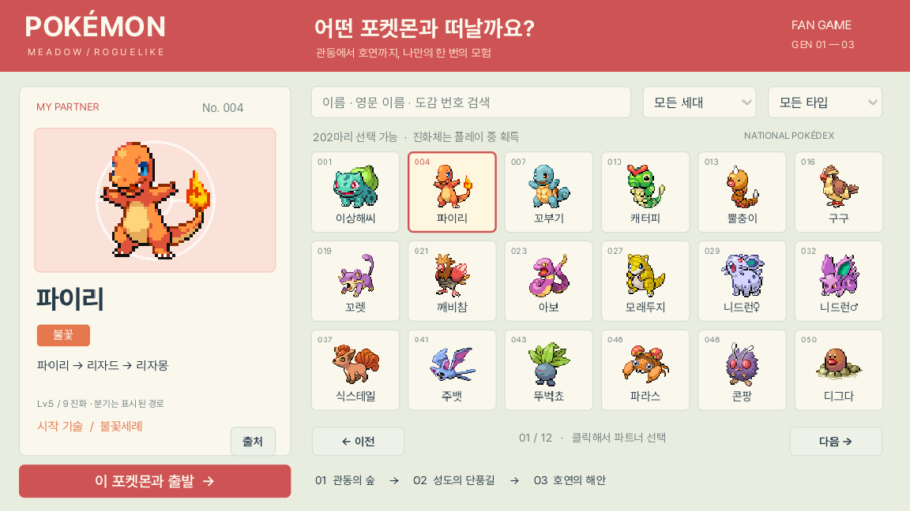
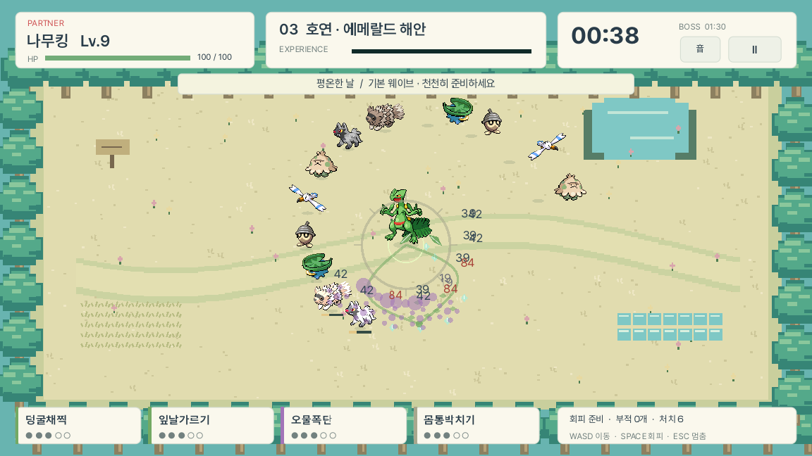

# Pokémon Meadow — 팬 로그라이크 프로토타입

1~3세대 386종을 바탕으로 기본 형태 202종 중 파트너를 고르고, 관동의 숲 → 성도의 단풍길 → 호연의 해안을 탐험하는 비공식 생존 팬게임입니다. 원작 IP 이용 허가는 미해결 상태이며 공개 배포가 허가된 프로젝트가 아닙니다.

## 시작하기

Finder에서 `플레이.command`를 열면 실행됩니다. Codex 파일 목록에서 클릭하면 내용 미리보기가 열릴 수 있으므로 Finder에서 실행하세요. 두 실행 파일은 상위 `.tools/Godot.app`을 사용합니다. 다른 컴퓨터에서는 Godot 4.7 이상으로 `project.godot`를 가져오거나 실행 파일의 엔진 경로를 수정하세요. 엔진 바이너리는 저장소에 포함하지 않습니다.

## 이번 버전

- 진화체를 제외한 기본 형태 202종 선택 (관동 71·성도 56·호연 75), 한글·영문·도감번호 검색, 세대·타입 필터와 페이지 이동.
- 기본 형태에서 시작해 Lv.5/9에 가능한 다음 형태로 진화. 진화가 없으면 현재 형태를 유지합니다. 분기 진화는 선택 화면에 보이는 대표 경로 하나를 사용하며 4세대 이후 진화는 제외합니다.
- 관동·성도·호연 3개 지역. 지역마다 90초 웨이브 후 팬텀·마기라스·메타그로스 보스 등장. 보스 등장 후 60초 안에 처치해야 합니다.
- 지역 클리어 시 무작위 부적 3개 중 하나 선택, 체력 25 회복. 레벨·진화·기술·부적은 다음 지역으로 이어집니다. 마지막 보스를 처치하면 승리합니다.
- 런마다 지역 조건과 기술/보상 선택이 달라집니다. 실패 후 다시 시작하면 성장과 부적이 초기화됩니다. 영구 해금·저장은 없습니다.
- 네 가지 기술을 각 5단계까지 강화. 모든 기술 완성 후에는 회복 선택이 나옵니다. 기술 구성과 진화 레벨은 원작과 다른 생존 게임용 규칙입니다.
- 세대 3 기준 타입, 17개 공격 타입의 상성. 원본 3스타터 기술 구성 유지, 나머지는 타입 기반 커스텀 구성입니다. 용의분노는 기술 강화로 기본 피해 40이 증가하지 않지만 런 부적 피해 보너스는 적용됩니다.
- 대기 숨쉬기, 이동 발걸음·기울임, 공격 반동, 피격 반응, 회피 잔상. 일시정지 중 캐릭터 애니메이션도 멈춥니다.
- 기술마다 투사체·공격 모양·적중 효과를 구분. 도감 프레임과 크림색 전투 패널, Pretendard Regular/SemiBold/Bold, 옅은 접지 그림자를 사용합니다.

## 조작

- WASD / 방향키: 이동
- Space: 회피
- Esc: 일시정지 / 계속
- 1·2·3: 기술 또는 부적 선택; 도감에서는 기존 세 스타터 단축 선택
- Enter: 선택한 포켓몬으로 출발 (검색창에서는 출발하지 않음)
- 마우스: 포켓몬·기술·부적 선택, 필터, 페이지 이동

## 검증과 구조

`tools/verify.command`가 규칙·전투·스타터·386종 카탈로그·지역 전환·세 스타터 전체 런 시뮬레이션·실제 창 입력·렌더링 검사를 실행합니다. 검증 기록은 [docs/VALIDATION.md](docs/VALIDATION.md)에 있습니다. 캡처는 화면 검사용으로 배치한 장면이며 사람의 플레이 기록이 아닙니다.

`catalog.gd`는 로스터, `journey.gd`는 지역·보상, `rules.gd`는 상성·기술, `arena.gd`는 전투 상태, `combat_fx.gd`는 효과, `interface.gd`는 도감·HUD를 담당합니다.

## 출처와 제한

[출처·권리 고지](docs/CREDITS.md), [설계와 참고 자료](docs/design/roguelike.md), 스프라이트·데이터·폰트의 버전과 SHA-256을 저장소에 기록했습니다. Pretendard는 동봉된 SIL OFL 1.1 조건에 따릅니다. Pokémon 원작 IP 허가와는 별개입니다.

스프라이트는 정면 정적 도트에 움직임을 적용한 것으로, 다방향 걷기 애니메이션은 아닙니다. 386종 개별 밸런스, 실제 사용자 전체 플레이 테스트, 최대 밀도에서 지속 프레임 성능, Windows/Web 내보내기는 아직 검증하지 않았습니다. 배경 지형은 장식이며 장애물 충돌은 없습니다.
